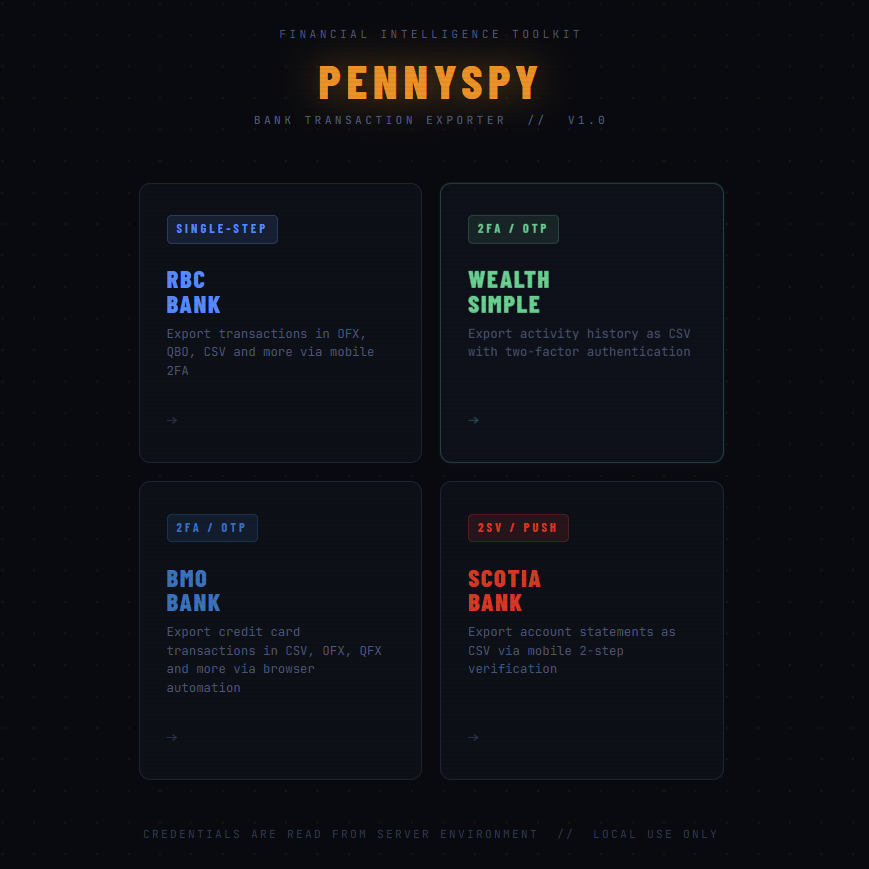

# PennySpy


[](https://opensource.org/licenses/MIT)

Canadian bank transaction scraper with API endpoints for automated retrieval of transaction history. Can be self-hosted on your computer directly via a Docker image or accessed directly through Python for seamless integration.

Running locally gives you full control over when and how data is retrieved. You can trigger requests on demand, making it fully compatible with modern banking security flows such as one-time passwords (OTP) and push-based two-factor authentication (2FA).
# Supported banks
- RBC bank
- Wealthsimple
- BMO bank
- Scotiabank

The API provides a landing page that allows users to easily download their transaction history.


# Installation
## Docker (Recommended)
Pennyspy api is available as a Docker image ready to be run in your own custom environment.
### Launch container using Docker Compose
You can use the `docker-compose.yml` file included in the repository to run the latest stable version of the API.
To create and run the container, you should use an `.env` file for your credentials or pass directly the credentials under the `docker-compose.yml` file:
```shell
docker compose up --detach
```
for required env variables, view the [setup](#Setup) for the bank of choice.

### Launch container using docker command
It is possible, alternatively, to use docker using this command.
```shell
docker run --restart=unless-stopped -d -p 5056:5056 -v YOUR/PATH/TO/DATA:/pennyspy --name pennyspy moqba/pennyspy:latest
```

## Python package
Pennyspy can be installed a python package :  
`pip install git+https://github.com/moqba/PennySpy`  
This allows you to run the scraper directly in Python.

Or start the [API service](#API) after installing the Python package :
```shell
pennyspy_api
```


# API
The main API service supports all banks.
It runs on the port 5056 by default, user can modify the port by setting `PENNYSPY_PORT` env variable.
The Docker image starts the API service automatically.
See the bank’s setup page for API call details.


# Setup
For RBC bank setup and API details, consult the [RBC setup guide](pennyspy/scrapers/rbc_bank/setup.md).

For Wealthsimple setup and API details, consult the [Wealthsimple setup guide](pennyspy/scrapers/wealthsimple/setup.md).

For BMO bank setup and API details, consult the [BMO setup guide](pennyspy/scrapers/bmo_bank/setup.md).

For Scotiabank setup and API details, consult the [Scotiabank setup guide](pennyspy/scrapers/scotiabank/setup.md).

